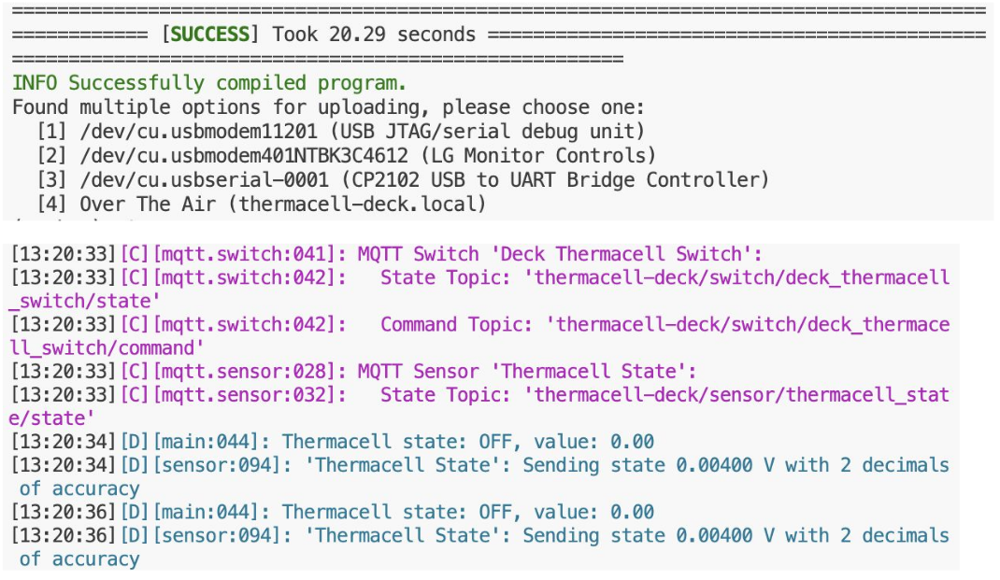
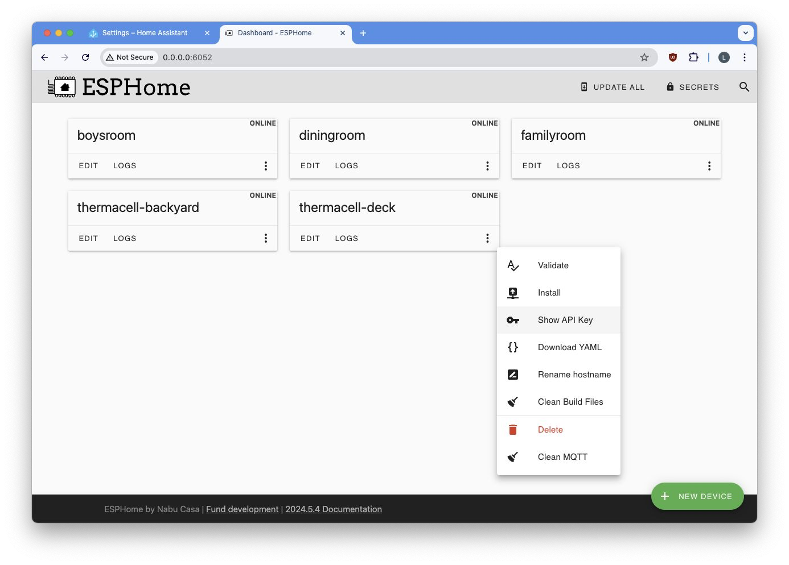
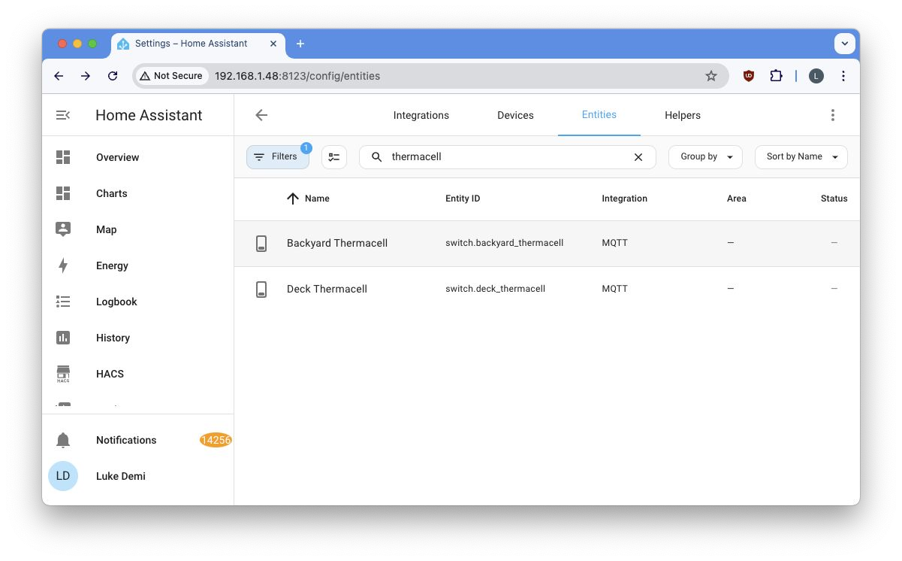
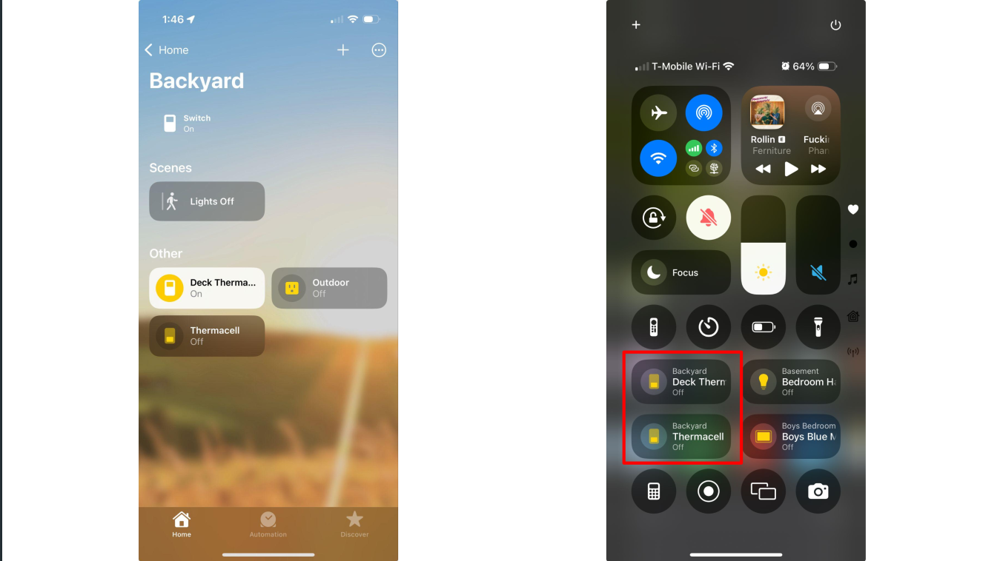
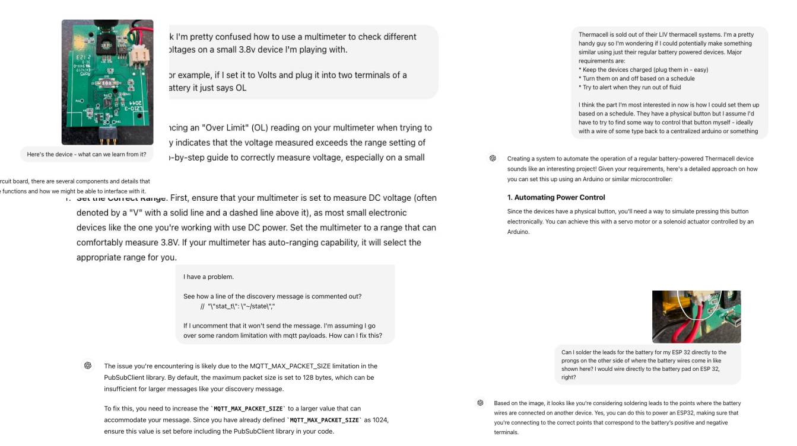



As a software guy, hardware hacking has long appealed to me. Until recently I just
never took the plunge past goofing off with an Arduino starter kit.
I like to think it was just a lack of a good use case, maybe it was fear. Regardless, no hardware hacking for me.

My lack of use case changed last spring when our family moved to a new house.
My neighbor must have had a marsh or something because we were getting absolutely destroyed by mosquitoes every time we stepped outside.
One day, I decided enough was enough and attempted to throw money at the problem. So, I turned to Wirecutter to find a solution.

## The Smart $800 Out-of-stock Solution

I stumbled upon the holy grail of mosquito repellents— a smart, Wi-Fi-enabled, app-controlled mosquito repelling system:



It's a sophisticated product. You set up a series of repellers in your
backyard and control them with an app. The app allows you to turn the
repellers on and off, put them on a schedule or timer, and even check
the level of repellent. Unfortunately, this all came at a price: $800.

So I decided to get the mid, not smart $50 version:



After a year of hassles, and some mosquito bites, I realized that this
cheaper version was like owning a pet.

- 🤬 I had to remember to turn it on and off.
- 😤 I had to remember to charge it.
- 😡 No notifications when fluid runs out.
- 😤 Impossible to automate.

By the next summer, I was ready to invest in the $800 system. I needed
the smart version with the colorful lights and WiFi connection. So I
went to the website to buy it: But by now it was out of stock! On top of that,
there were a bunch of negative reviews about how janky the app was, how the 
repellers didn't connect to 5G Wi-Fi, and so on.

## My DIY Smart 40$ Solution

I couldn't buy the smart mosquito repellent, so I decided to build one myself. How hard could it be? (Spoiler alert: harder than I thought, but surprisingly simple)

I wanted my version to be better:

- ✅ Cheap (sub $40 per repeller).
- ✅ Automatable with the [Home Assistant](https://www.home-assistant.io/) home automation platform.
- ✅ HomeKit support.
- ✅ In stock!

After some tinkering, amateur soldering, lots of ChatGPT conversations, and a fair bit of cursing, I turned the mid version devices into smart WiFi-connected ones using an ESP32 micro-controller:



I now have a network of smart mosquito repellents that I can:

- ✅ Control from my phone via WiFi.
- ✅ Set on schedules.
- ✅ Receive status notifications for each repellent.
- ✅ Automate based on when I'm actually outside.

## Dumb to Smart Device Conversion Plan: The ESP32

The brain of my smart mosquito repellent system is the ESP32 micro-controller, the Swiss Army knife of IoT projects:



This little chip has everything you need for a IoT project:

- ✅ Wi-Fi + Bluetooth.
- ✅ 4MB Flash memory.
- ✅ 520KB of RAM.
- ✅ 240 MHz (dual core) CPU.
- ✅ Can be connected to Home Assistant via [ESPHome](https://esphome.io/guides/getting_started_hassio.html).
- ✅ Cheap.
- ✅ Perfect for turning dumb devices into smart ones.
- ✅ Can run C code.

Unlike a Raspberry Pi, the ESP32 has a low power consumption and I could power it using the Thermacell's battery.

I found this cool small ESP32 version for $5 and decided to go with it. Here is the full diagram of this ESP32:



Here, we have the following:

- **GPIO Pins (Green):** General-purpose input/output (GPIO) pins that can be programmed. For example, you could use a GPIO pin to read the state of a button (input) or to turn an LED on and off (output).
- **Analog Input Pins (Light Red):** Used to read analog signals.
- **Power Pins:**
    - **5V:** 5V power output.
    - **3V3:** 3.3V power output.
    - **GND:** Ground.
- **Battery Connector (BAT):** Pin for connecting a battery. The cool thing about this connector is that if you plug the ESP32 and connect it to a battery, the ESP32 will actually charge the battery.
- **Thermal Pad:** Helps with heat dissipation for the microcontroller.

The other pins I haven’t mentioned are for other purposes beyond the scope of this post.

### The Plan

Now the plan was simple:

- 🔧 Use the ESP32 to control the dumb Thermacell device.
- 🔧 Connect it to my home Wi-Fi.
- 🔧 Control it through my phone via Home Assistant.
- 🔧 Automate everything.

## Reverse Engineering the Mid Version Thermacell

The Thermacell is a little device that uses heat to vaporize mosquito repellent. Simple, effective, but about as smart as a brick:



You manually turn it on, and it does its thing. If you forget to turn it off you waste a cartridge of repellent (this happened every single time).

I had a few of these, so I decided to crack one open (literally):



**Note:** I later realized it actually had triangle screws hidden underneath small pads, but it was too late for this one.

Inside, I found a simple circuit board, a battery, and the heating element. The circuit was straightforward: power goes in, heat comes out:



Now I need:

- 🔧 A way to programmatically switch the device on and off.
- 🔧 Read whether it is on or off.
- 🔧 Provide power to the ESP32.

Powering the ESP32 was simpler than I thought, as the 3.8V battery on the device can do the job (or, at least ChatGPT told me it can!).

Analyzing the board, I identified the key components:



Here we have:

- **Resistors**: These regulate the flow of electrical current within the device.
- **Capacitors**: These store and release energy, ensuring a stable power supply.
- **Diodes**: These allow the flow of electricity in a single direction, preventing damage to the circuit.
- **Transistors**: If it receives a small input signal on one terminal, it controls the connection between the other two terminals.
- **Integrated circuits**: These are the "black boxes" that handle more complex functions, such as charging and temperature regulation.
- **Switch**: A button to turn the device on and off.
- **Power Connector**: Provides power to the board and heating element.
- **Test Pads**: Probably used for testing and debugging purposes.

With a better understanding of the device's internals, I set out to find a way to control the heating element using the ESP32 microcontroller. Now I need to find a way to turn the device on, and a way to know if it’s on.

For turning it on, ChatGPT suggested I bridge the switch:



It worked! Easy.

Now, I need to determine whether it was on or not. This turned out to be way harder than I thought.

I bought a multi-meter with the goal of checking the difference between the device's on and off states. I also entertained the idea of buying an oscilloscope, but quickly forgot about it once I found out even the cheap ones cost $400+ (I occasionally remind myself that this project is to "save" money).

While searching the web, I stumbled upon a sweet alternative to the physical oscilloscope: the open-source [ESP32 Oscilloscope](https://github.com/BojanJurca/Esp32_oscilloscope) project.

So I analyzed the signals going from pad to pad. The off state is marked by red and the on state is marked by green.



Here:

- When it’s high at 4 Volts: it’s off.
- When it’s low at near 0 Volts: it’s on.

Now, this difference in Volts is not always there, some pads stop giving this signal when the battery is fully charged. So I tested all of them until I found one that worked consistently regardless of the battery’s state.

At this point, I can:

- See if the device is on or not.
- Turn it on by bridging two pads.

I now needed to solder a few wires to the board so that the ESP32 could control the heating element and detect whether the device was on or off.

## Hacking Hardware and Soldering Adventures (and Misadventures)

So, let’s start with powering things.

I connected the Thermacell’s battery connector with the ESP32’s battery interface:



Next, I connected the Thermacell with an ESP32 analog pin to read the variation in voltage:



Reading the values here is how I determined whether the Thermacell was on or off, as I explained in the previous section.

Next, I needed to use a transistor to control the Thermacell’s switch:



The transistor here works like a switch: when the middle pin receives a signal (a 3V high from the ESP32), it connects between the other two pins, and turns on the Thermacell.

Here is the final circuit:



I soldered everything with the skills of a true software guy:



With the hardware part out of the way, I can now program the ESP32 and connect it to Home Assistant through MQTT.

## Using MQTT and ESPHome for Integration with Home Assistant

MQTT is a lightweight messaging protocol designed for IoT devices, allowing them to send and receive data efficiently.

[Mosquitto](https://mosquitto.org/), pun obviously not intended, is an open-source MQTT broker.

The great thing about MQTT is that once the devices are connected to my MQTT server, they automatically connect with Home Assistant, instantly integrating themselves into my smart home setup without any manual configuration.

### My Initial Experiment with Low-level C Code

At first, I wrote [210 lines of low-level C code](https://gist.github.com/lukedemi/344964aed524f54e9a709061ad1139a6) for the ESP32 to control the Thermacell, communicate its status, and integrate it with Home Assistant.

The code has the following parts:

- **Setup Function:**
    - Connects the ESP32 to the Wi-Fi network and retrieves the device's MAC address to create a unique ID.
    - Sets up MQTT topics for commands, state updates, and discovery.
    - Connects to the MQTT server and sets up a callback function to handle incoming messages.
- **Loop Function:**
    - Continuous MQTT connection.
    - Sends periodic status updates (every 10 seconds) to the MQTT server, reporting whether the Thermacell is on or off.
    - Sends a discovery message for Home Assistant integration.
- **Callback Function:**
    - This function is triggered when an MQTT message is received. It listens to the `commandTopic`, checking whether to turn the Thermacell on or off.
    - If the message is "ON", it sets the `controlPin` high for 500ms to activate the device and then publishes the state as "ON". If the message is "OFF", it holds the pin high for 4 seconds, which turns it off.
- **Discovery and Status Updates:**
    - The `publishDiscoveryMessage()` function sends a JSON payload to Home Assistant, allowing it to automatically discover and integrate the device.
    - The `sendStatusUpdate()` function checks the analog value from the `statusPin` to determine whether the Thermacell is on or off and reports this via MQTT.

The code was messy and way too complicated.

However…



It actually worked!

After everything was soldered together, I jammed the components inside the Thermacell case:



The highlighted part is an antenna for the ESP32 to improve the WiFi connection.

But still.. I felt like something was missing. I was not satisfied with the code and kept looking for ways to make better.

### Oh, there is a better way, actually: ESPHome

I quickly realized there was an easier, more elegant solution—[ESPHome](https://esphome.io/), which is an open-source platform that makes programming the ESP32 super simple. Instead of writing code in C or dealing with complex libraries, ESPHome allows you to configure your device using YAML, a human-readable format.

The beauty of ESPHome is its tight integration with Home Assistant. You just define how you want the device to behave in a YAML configuration file, and ESPHome takes care of the rest, including managing connections and automations.

So I decided to ditch the convoluted C code and start from scratch.

First, I set up the basic configuration and connections in a file called `common.yaml`:



Next, I wrote the code to control the Thermacell in a file called [**`thermacell.yaml`**](https://gist.github.com/lukedemi/a7a13e74e1a7bfaa3866b483bea45ae1#file-thermacell-yaml):

```yaml
output:
  - platform: gpio
    pin: GPIO2
    id: thermacell_output

switch:
  - platform: template
    name: "${friendly_name} Switch"
    id: thermacell_switch
    restore_mode: DISABLED
    turn_on_action:
      - lambda: |-
          ESP_LOGD("main", "Turning ON Thermacell");
          id(thermacell_output).turn_on();
          delay(1000);
          id(thermacell_output).turn_off();
          ESP_LOGD("main", "Thermacell ON sequence complete");
          id(thermacell_switch).publish_state(true);
    turn_off_action:
      - lambda: |-
          ESP_LOGD("main", "Turning OFF Thermacell");
          id(thermacell_output).turn_on();
          delay(4000);
          id(thermacell_output).turn_off();
          ESP_LOGD("main", "Thermacell OFF sequence complete");
          id(thermacell_switch).publish_state(false);
sensor:
  - platform: adc
    pin: GPIO3
    name: "Thermacell State"
    id: thermacell_state
    update_interval: 500ms
    filters:
      - sliding_window_moving_average:
          window_size: 10
          send_every: 10
      - lambda: |-
          if (x > 0.3) {  // Assuming HIGH is represented by a value > 0.5
            id(thermacell_switch).publish_state(true);
            ESP_LOGD("main", "Thermacell state: ON, value: %.2f", x);
          } else {
            id(thermacell_switch).publish_state(false);
            ESP_LOGD("main", "Thermacell state: OFF, value: %.2f", x);
          }
          return x;

```

Here is a brief explanation of what this code does:

- **Output Section:** Configures a GPIO pin to control the Thermacell device.
- **Switch Section:**
    - A template switch is defined to control the Thermacell. This switch doesn’t directly toggle the pin but instead runs custom actions (using lambda functions) when turned on or off.
    - **Turn On Action:** When the switch is turned on, the output pin (`thermacell_output`) is turned on, waits for 1 second, and then turns off. It logs the event and updates the switch state to "ON."
    - **Turn Off Action:** Similar to turning on, but with a 4-second delay to ensure the device turns off properly. It logs the event and updates the switch state to "OFF."
- **Sensor Section:**
    - This configures an analog-to-digital converter (ADC) sensor on `GPIO3` to monitor the Thermacell’s state. It uses a sliding window average to smooth out noise from the sensor readings and updates every 500ms.
    - The lambda function checks the sensor value. If it’s above 0.3, it considers the device "ON" and publishes the state accordingly, logging the event with the current value. Otherwise, it considers the device "OFF."

Finally, I created a YAML configuration for each Thermacell device. For example, this one is for the backyard repellent:

```yaml
# thermacell-backyard.yaml

substitutions:
  device_name: thermacell-backyard
  friendly_name: "Backyard Thermacell"

# Include common settings
<<: !include common/common.yaml

# Include common thermacell settings
<<: !include common/thermacell.yaml

esphome:
  name: ${device_name}

esp32:
  board: seeed_xiao_esp32c3
  framework:
    type: arduino
```

I created separate YAML files for each device—like `thermacell-backyard.yaml` for the backyard unit and `thermacell-deck.yaml` for the deck repellent.

Now, it was time for the moment of truth: running the YAML files for each device.

```yaml
$ esphome run thermacell-backyard.yaml
$ esphome run thermacell-deck.yaml
```

The output reports the state of each Thermacell device every few seconds:



## Final Result

I can now control and monitor the logs of my Thermacell devices directly from the browser:



The best part is that my devices magically show up on Home Assistant:



And by extension, they also magically show up on my phone:



I can now control my Thermacells just as easily as I control the lights in the basement!


How cool is that?

### The End

Finally, I can enjoy my mosquito-free backyard.


## Future Improvements

Although this system works great, there is still room for improvement:

- **💡Better Fluid Tracking:** Implement a more accurate method to monitor repellent fluid levels, possibly by integrating sensors that can detect fluid depletion in real-time.
- **💡Outdoor Automation:** Use motion detection or camera-based sensors to automatically activate the Thermacell when someone steps outside.
- **💡Battery Optimization:** Improve battery efficiency by leveraging deep sleep modes or solar charging, ensuring the Thermacells can run for longer periods without frequent recharging.
- **💡Safety Measures:** Add safety features such as temperature monitoring to prevent overheating, or maybe use fire-resistant casings for protection.
- **💡Additional Sensors:** Add extra sensors like temperature, humidity, and motion detectors to create a more intelligent environment and allow for smarter automations.
- **💡LED Status Indicators:** Add fancy LED lighting to signal device status (e.g., on/off, low fluid) or just add some aesthetic flair to the setup.

## Lessons Learned

Here are some of the key lessons I took away from this project:

- **🎓The Power of ChatGPT:** I relied heavily on ChatGPT at every stage of this project, from debugging code to identifying hardware components. It’s an awesome learning partner!



- **🎓Stepping Out of My Comfort Zone:** Coming from a software background, diving into hardware was a big challenge.
- **🎓Leverage Open-Source Libraries:** One big takeaway was to always look for existing open-source libraries or solutions before diving into messy, low-level code. Projects like ESPHome made my life significantly easier.
- **🎓Iterate and Improve:** Throughout the project, I made several mistakes—from botched soldering jobs to initial code missteps—but each misstep was an opportunity to iterate, learn, and improve the solution.
- **🎓Hardware Hacking Is Accessible:** You don’t need to be an electrical engineer to start hacking hardware. With platforms like ESPHome and Home Assistant, even complex home automation projects can be accessible to beginners with a little curiosity and effort.